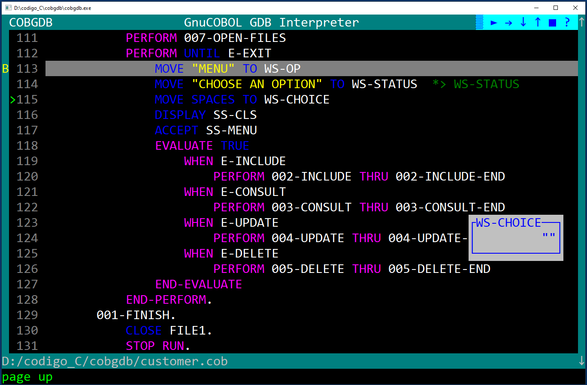

<h1>COBGDB</h1>

It is a command-line application, programmed in C, designed to assist in debugging GnuCOBOL code using GDB. The application is based on the extension for Visual Studio Code (VSCode) created by Oleg Kunitsyn, which can be found on GitHub: https://github.com/OlegKunitsyn/gnucobol-debug. COBGDB is currently in development.

In the Windows subdirectory, the executable program for this operating system is available.

To compile the code on Windows, you can use MinGW. The Makefile is configured to generate the program for both Windows and Linux.

To run the example program:

1. On Windows, first install MinGW (Minimalist GNU for Windows).
2. Execute the make ('mingw32-make' for Windows) command to compile the code.
3. Run the example program using the following command:
```bash
cobgdb customer.cob -lpdcurses
```
   
In the example above, '-lpdcurses' is an instance of an argument that can be indirectly passed to 'cobc' by 'cobgdb,' even if it is not used by 'cobgdb' itself.

On Linux, it is recommended to use Xterm to view the application.


COBGDB running:




**Main commands:**

- `B` - Sets a breakpoint at a specific point in the code.
- `R` - Runs the program until a breakpoint is encountered.
- `C` - Runs the program until it reaches the selected line.
- `J` - Runs the program until it reaches the specified line.
- `N` - Runs the program until the next line but does not enter a subroutine executed by CALL or PERFORM.
- `S` - Runs the program until the next line.
- `G` - Continues the program execution until it encounters a stopping point: breakpoint, end of the program, or the return from a subroutine (PERFORM/CALL).
- `V` - Displays the set of variables for the running program.
- `H` - Shows the values of variables for the selected line.
- `F` - Allows selecting the source file for debugging.
- `A` - Attach to GDBSERVER or Application PID.
- `Q` - Quits the program.

COBGDB takes one or more programs with COB/CBL extension as parameters and runs the GnuCOBOL compiler with the following format:
```bash

cobc -g -fsource-location -ftraceall -v -free -O0 -x prog.cob prog2.cob ...
```

**Example:**

To debug multiple programs, use COBGDB with the following syntax:

```bash
cobgdb prog.cob subprog1.cob subprog2.cob
```

You can run GDB/GDBSERVER remotely using the `A` key. COBGDD will prompt you to provide the server and port in the format `server:port` or the PID of the application.

**Example:**
- `localhost:5555`
- `9112`

Debugging application output:


